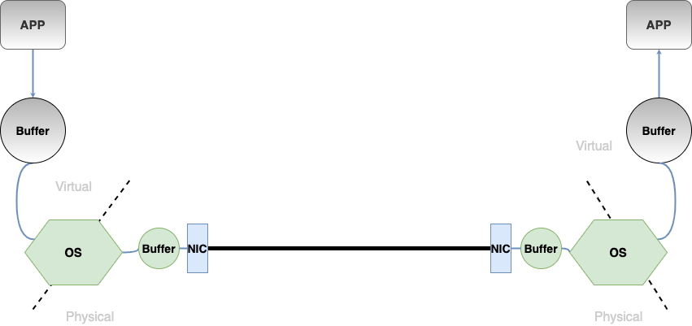

# Distributed-KV

This project is a fork from [KVell](https://dl.acm.org/doi/abs/10.1145/3341301.3359628) project. I am trying to implement client/server key-value store using KVell implementation. The objective is to measure the networking overhead. Therefore, I found it suitable to measure and compare different networking approach such as TCP/IP and RDMA. For future work, I am interested in using [eRPC](https://www.usenix.org/conference/nsdi19/presentation/kalia) as another approach for implementing Distributed KVell.

---
## InfiniBand

InfiniBand (IB) is a high-speed, low latency, low CPU overhead, highly efficient and scalable server and storage interconnect technology. One of the key capabilities of InfiniBand is its sup- port for native Remote Direct Memory Access (RDMA). It enables data transfer without the involvement of the host CPU in the data path. InfiniBand uses I/O channels for data communication (up to 16 million per host), where each channel provides the semantics of a virtualized NIC.

## RDMA

Like sockets in traditional socket based programming, queue pair (QP) defines the address of the communication endpoints in RDMA based connectivity. Therefore, Each communication endpoint needs to create a QP in order to talk to each other. There are three different types of QP:

1. Reliable Connection (RC)

2. Unreliable Connection (UC)

3. Unreliable Datagram (UD)

When QP is defined, initialized, and connected using one of the RC or UC types, it can only talk to **one other** QP. Otherwise, if QP is created as UD, it is able to talk to **any other** QPs.   

In RDMA based programming, verb is a term that defines the types of communication operations. There are two different communication primitives: **channel semantics (send/receive)** and **memory semantics (read/write)**. If we only consider how data is delivered to the other end, channel semantics involves both communication endpoints. Memory semantics only involves one side of the communication endpoint: the sender can write the data directly to the receiver's memory region, or the receiver can read from the target's memory region without notifying the target.

Generally speaking, memory semantics has less overhead compared to channel semantics and thus has higher raw performance; On the other hand, channel semantics involves less programming effort.

## RDMA over Converged Ethernet (RoCE)

RoCE is a standard for RDMA over Ethernet. It provides true RDMA semantics for Ethernet as it does not require the complex and low performance TCP transport. RoCE is the most efficient low latency Ethernet solution today. It requires a very low CPU overhead and takes advantage of Priority Flow Control in Data Center Bridging Ethernet for lossless connectivity.

In traditional sockets networks, applications request network resources from the operating system through an API which conducts the transaction on their behalf. However RDMA use the OS to establish a channel and then allows applications to directly exchange messages without further OS intervention. A message can be an RDMA Read, an RDMA Write operation or a Send/ Receive operation.

TCP/IP/Ethernet is a byte-stream oriented transport for passing bytes of information between sockets applications. TCP/IP is lossy by design but implements a reliability scheme using the Transmission Control Protocol (TCP). TCP/IP requires Operating System (OS) intervention for every operation which includes buffer copying on both ends of the wire. in byte-stream oriented networks, the idea of a message boundary is lost. When an application wants to send a packet, the OS places the bytes into an anonymous buffer in main memory belonging to the operating system and when the byte transfer is complete, the OS copies the data in its buffer into the receive buffer of the application. This process is repeated each time a packet arrives until the entire byte stream is received. TCP is responsible for retransmitting any lost packets due to congestion.
